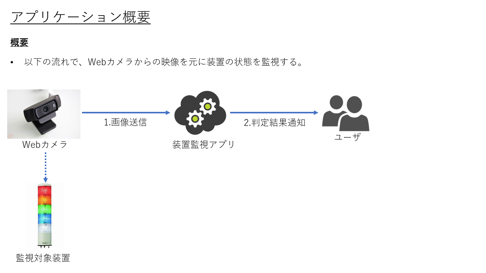
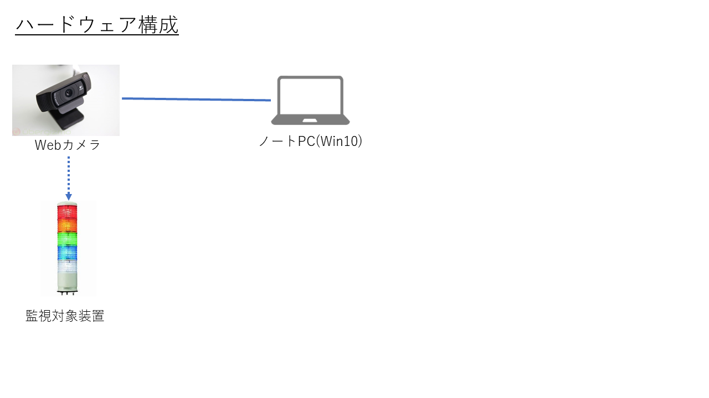
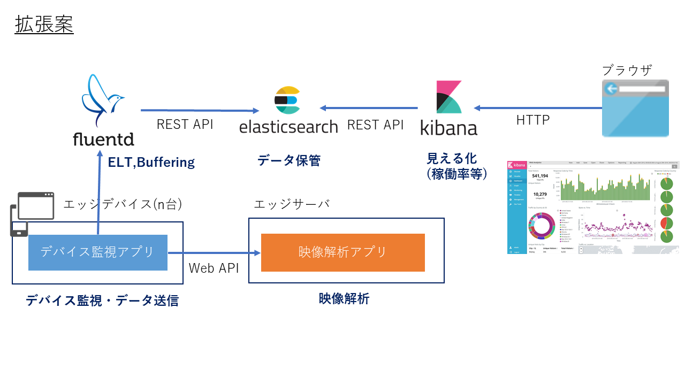

# device-watching

## ソフトウェア概要

## アプリケーションデモ
行灯は高くて変えなかったので、いろいろ光るもので代用。

### アプリケーションデモ その1
天井のシーリングを使って動作確認した様子。

### アプリケーションデモ その2
100円均一で買ったライトを使って動作確認した様子。

### アプリケーションデモ その3
ブレッドボード上にLEDを3つ付けて、1つずつ点灯させて、動作確認した様子。

